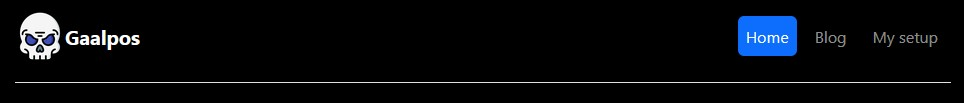
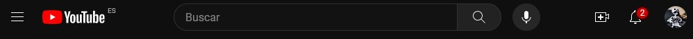
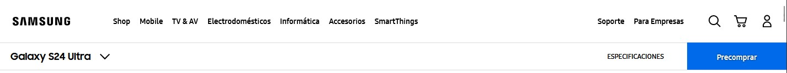
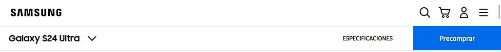
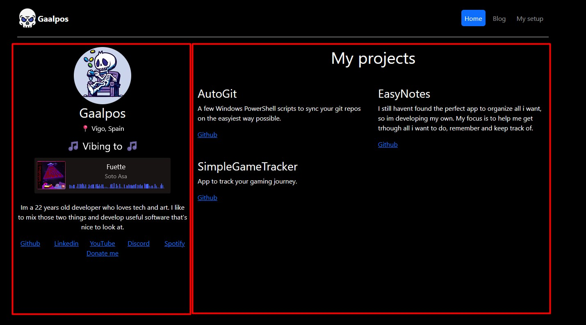

# Task T4.1 - Responsive web

This is a responsive web made with Bootsrap and JS

You can see the Figma mockup  [here](https://www.figma.com/file/AnU8UYQMIDdgaxrcn7gZfH/T4.1-Pazos%2C-Gabriel?type=design&node-id=0%3A1&mode=design&t=QzAojjQqgA4l60hs-1)

Live web : https://gaalpos.github.io/niceWeb/

- NavBar on desktob and hamburger menu for narrower screens.
- Images on the "Setup" section
- No accesibility errors (WAVE marks one empty button as an error. However it is needed for the navbar to collapse into an hamburger menu when needed) 
- Export used in **elementos.js** to export the objects for **main.js** to import those objects and create the html needed
- Arrow function used in **main.js** on const generarHTML
- Objects are in  **elementos.js**

##  Laws of UX used on this project

### Aesthetic-Usability Effect
- Users often perceive aesthetically pleasing design as design that’s more usable.

My web is designed with simplicity on mind, without a huge variety of colors or elements. This helps overwhelm the user. 

### Jakob’s Law
- Users spend most of their time on other sites. This means that users prefer your site to work the same way as all the other sites they already know.

We have a few desing choices that follow this idea. Look at this image:

That's the header of the site, where the title,logo and navbar are located. 

Most sites have their logo/name on the top left. If you click on that, you go the home page. It's the same way on my web. 

Other elements like account, search or web sections are often in the right. It's true that in many sites the nav links are on the left, but as it's shown in the Samsung web, when collapsed, the hamburger menu with all the nav links goes to the side. In order to have consistency beteween desktop and mobile, I have the nav items on the right. This also helps to have a visual balance.

### Law of Common Region
- Elements tend to be perceived into groups if they are sharing an area with a clearly defined boundary.

In the home page there are two areas well defined, even without using any type of additional elemtents to divide those areas.

The one on the left is my profile. All elements are aligned to the middle, which makes you perceive them on the same group. 

The area on the right has all my projects. The text alignment is to the left and has a title over them, so you know all of those elements are on the same group.

